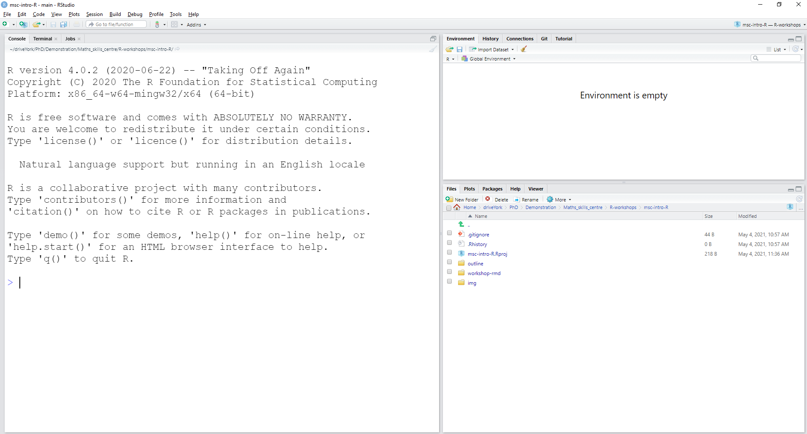

```{r setup, include=FALSE}
knitr::opts_chunk$set(echo = TRUE)
library(ggplot2)
library(patchwork)
```

```{r import NHANES data for developer, include = FALSE}
health_data <- readr::read_csv("../data/NHANES.csv")
```

```{r import iris data for developer, include = FALSE}
flower_data <- readr::read_csv("../data/iris.csv")
```

This document contains all the materials covered in the Introduction to
RStudio workshop of the Maths Skills Centre. This workshop introduces
the RStudio environment, writing code in a script, importing and viewing
data, data wrangling and data visualisation.

# Setup

You can follow the instructions
[here](https://datacarpentry.org/r-socialsci/setup.html) to install or
update R and RStudio. This workshop was assembled using R version
`r paste(R.Version()$major, ".", R.Version()$minor, sep = "")` and
RStudio version `r rstudioapi::versionInfo()$version`.

# Overview of RStudio

> Questions:\
> 1. What are the four panels in RStudio?\
> 2. How is a project set up in RStudio?\
> 3. Where do we save files for RStudio to use?
>
> Objectives:\
> 1. Navigate the RStudio environment.\
> 2. Set up an RStudio project for the workshop.\
> 3. Save the workshop files from the vle into the project working
> directory.

## Navigating the RStudio environment

RStudio has four panels. When RStudio is opened for the first time, only
three are visible:

```{r, echo=FALSE, fig.cap="*When RStudio is first started, three panels are visible*.", fig.alt="A screenshot of Rstudio showing eleven menus at the top left. One panel covers the left half with text about the R software. The right is divided into two panels with text saying that the environment is empty in the top panel and a display of the current file directory in the bottom panel."}

```

The fourth panel appears after we open a new *script*. Do so by pressing
on the icons highlighted below:

```{r, echo=FALSE, fig.cap='*Open a script by pressing the "New File" button, followed by "R Script"*.', fig.alt="Two zoomed in screenshots of the top left menus in RStudio. The first screenshot shows a black rectangle highlighting an icon which is a white square with a plus inside a green circle. The second screenshot shows a black rectangle highlighting a menu item that reads R Script followed by the associated keyboard shortcut, Ctrl + Shift + N."}
knitr::include_graphics("../img/open-script.png")
```

Now you should see four panels, as shown below:

```{r, echo=FALSE, fig.cap="*After opening a new script, RStudio has four panels*.", fig.alt="A screenshot of Rstudio showing four panels. The left half of the screen is divided into two panels. The top left panel shows an empty R script. The bottom left panel shows text about the R software. The right is divided into two panels. The top right panbel has text saying that the environment is empty. The bottom right panel shows the current file directory."}
knitr::include_graphics("../img/four-panel-RStudio.png")
```

What is the purpose of these panels?

-   *Top left*: this area is for the **script**. A script is a text file
    in which we write R code. The script can be saved, such that we can
    return to coding and use our code at a later date. Saving a script
    also allows us to share our analysis with colleagues.\
-   *Bottom left*: this is the **console** area. Here we can also write
    code, however this is not saved when we close R. It is therefore
    better practice to code from the script. Additionally, RStudio
    returns output to us in the console. For example, a response to the
    command `4 + 4` will appear in the console.\
-   *Top right*: this is the *environment* area. Here the names of
    everything we import into or create in RStudio will appear. For
    example, when we import a spreadsheet into RStudio, it appears in
    the environment.\
-   *Bottom right*: this is a multifunctional area, including our file
    directories and plots.

## Setting up a project in RStudio

When working with RStudio, for example for an analysis or even this
workshop, it is good practice to have all relevant files in one folder.
This makes it easier to locate files and to share our work with
colleagues. This folder is called our **working directory**.

A convenient way to set and save a working directory is through the
RStudio *projects* functionality. Here we create a `.Rproj` file, which
marks our RStudio project. The folder in which the `.Rproj` file is
saved will be our working directory. To set up an RStudio project:

-   Under the *File* menu in the top left of RStudio, press *New
    Project*, then *New Directory*, then *New Project*.
-   Provide a *Directory name* - this will be the name of the newly
    created folder. For example, you could name it `intro_R_workshop`.
-   Under *Create project as subdirectory of*, select a convenient
    location for this new folder. For example, this could be your
    `Documents` folder.

RStudio should now have refreshed, showing us our project environment.
Open a new script, as we did in the previous section, such that the
four-panel view is restored. Then save the script by pressing the Save
icon (the floppy disk) to the right of the New File button. Give the
file a convenient name, such as `intro_R_code`. It will then appear in
the bottom right of RStudio as `intro_R_code.R`.

## Saving data files in our working directory

As mentioned above, one of the features of the RStudio project is that
it allows us to have all relevant files in one folder. We will download
the data files for this workshop and save them inside our project
directory:

1.  Create a folder named `data` in your working directory by pressing
    on 'New Folder' in the *Files* panel (bottom right panel).
2.  Similarly, create a folder named `results` in your working
    directory.
3.  Save the example data (`NHANES.csv`) from
    [here](https://raw.githubusercontent.com/ezherman/msc-intro-R/main/data/NHANES.csv)
    into the `data` folder.
4.  Save the exercise data (`iris.csv`) from
    [here](https://raw.githubusercontent.com/ezherman/msc-intro-R/main/data/iris.csv)
    into the `data` folder.

Now the data is accessible from the `data` folder in our working
directory in RStudio.

# Writing code in a script

> Questions:\
> 1. What are the common terms used to describe R code?\
> 2. What is the structure of commands in R?\
> 3. How can data be entered into RStudio manually?\
> 4. How are notes written alongside code?\
> 5. How and why do we install packages?
>
> Objectives:\
> 1. Define the following R terminology: *object*, *assign*, *call*,
> *function*, *arguments* and *options*.\
> 2. Use a built-in *function* and control its working with an
> *argument* and an *option*.\
> 3. Assign values to a named *vector* using the `c()` function.\
> 4. Write *comments* to make a script easier to interpret.\
> 5. Install and load the `readr` package.

## Common R terminology

### *Assign* a value to an *object*

In R, everything that we create or import is saved as an *object*. An
*object* has a name, with which we can refer to it. When we save
something as an *object*, this is referred to as *assigning* something
to that object. *Assigning* is done using the `<-` syntax, as shown
below. If we wanted to save the number 4 under the name `four`, we would
type in our script:

```{r assign value to object example}
four <- 4
```

There are two ways to run this code:

-   With our cursor on the same line as the code, or with the code
    highlighted, press the "Run" button in the top right of the script
    panel.
-   With our cursor on the same line as the code, or with the code
    highlighted, use the keyboard shortcut `Ctrl` + `Enter` (`Cmd` +
    `Return` on Mac).

After running this code, we see `four` has appeared in the environment
window. This confirms that we have successfully *assigned* a value to an
*object*.

### *Calling* a built-in *function* with one *argument*

Most commands in R involve *functions*. A *function* is an in-built
piece of code that performs a specific task. When a *function* is used
in R, this is referred to as *calling* the *function*. Usually, a
*function* is *called* with one or more inputs - these are called
*arguments*.

Let us take the `round()` function as an example. This *function* rounds
a supplied value.\
For example, we *call* the `round()` function on the value 3.14. The
value 3.14 is an *argument* in our *call*:

```{r, eval = FALSE}
round(3.14)
```

R then returns in the console:

```{r, echo = FALSE}
round(3.14)
```

An *argument* can also be an *object*, as you will see in the challenge
at the end of this section.

### Including an *argument* with an *option* in a *function* call

Often the behaviour of a *function* can be manipulated using *arguments*
which take *options*. These *options* have defaults, which are assumed
if we do not specify an alternative.

For example, the `round()` function takes the `digits` *argument*, for
which the default is `digits = 0`. That is why so far, `round()` has
returned values with 0 digits behind the decimal.

We can specify an alternative *option* for the `digits` *argument*, for
example for a single digit behind the decimal:

```{r}
round(3.14, digits = 1)
```

<details>

<summary>

**Challenge**: *assign* the value 6.667 to an *object* named `number`.
Then, *call* the `round()` *function* on the *object* `number`. Ensure
that `round()` returns two digits behind the decimal. Find the solution
in the drop-down.

</summary>

<br>

```{r}
number <- 6.667
round(number, digits = 2)
```

</details>

### *Vectors* using the `c()` *function*

So far, we have worked with *objects* that contained a single value.
Often we are working with multiple data points. In R, multiple data
points can be saved inside one *object* as a *vector*. A *vector* is a
collection of data points of the *same type* (e.g. numbers or words).
*Vectors* are formed by calling the `c()` function, with data provided
between the brackets, separated by commas. For example:

```{r}
numbers <- c(1,2,3,4,5,6)
```

*Vectors* can also contain words, which we call *strings* in R. Ensure
that *strings* are always wrapped in quotes:

```{r}
colours <- c("red", "blue", "green")
```

Later in this workshop we will learn how to import data without needing
to manually type data into `c()`.

### Writing *comments* to enhance script readability

As we progress through this workshop, our script will fill up with many
lines of code. To enhance readability for ourselves and for colleagues
who may use our script at a later date, we include *comments*.

Any text in R that is preceded by a `#` is ignored by R and treated as a
*comment*. For example, if we were to *comment* when creating our vector
`numbers`:

```{r}
# create a vector of the numbers 1 to 6
numbers <- c(1,2,3,4,5,6)
```

<details>

<summary>

**Challenge**: *assign* the city names London, Manchester and Newcastle
to an *object* named `cities`. Include a *comment* to increase the
clarity of your code. Find the solution in the drop-down.

</summary>

<br>

```{r}
# a vector of city names
cities <- c("London", "Manchester", "Newcastle")
```

</details>

### Installing and loading packages

So far, we have used the built-in *functions* `round()` and `c()`. R has
many useful *functions*, some of which do not come built-in. Rather than
releasing individual *functions*, collections of *functions* are
released together in *packages*. Therefore, to use an external
*function*, we need to install and load the appropriate *package*.

Working with *packages* is analogous to using a new light bulb:

1.  First, we install the package in R using the `install.packages()`
    function. This is analogous to screwing a new light bulb into the
    socket - we only need to do this **once**.\
2.  Then, every time we open RStudio and want to use the package, we
    need to load it using the `library()` function. This is analogous to
    using a light bulb - every time we enter the room, we need to turn
    on the light again.

Let us take the `readr` *package* as an example. This package contains a
set of functions for importing data into R. In the next section, we will
use a *function* from this *package*. First, we install the *package*.
You can run the following line from the *console* rather than the
*script*, as we do not want the *package* to install again every time we
run the *script*:

```{r install readr, eval = FALSE}
# install the readr package
install.packages("readr")
```

Then we load the *package*. It is good practice to load all *packages*
at the top of our *script*. This way, it is easy for another user to
identify whether they need to install any *packages* before running your
*script*. Therefore, paste the following code at or near the top of your
script:

```{r load readr}
# loading a package
library(readr)
```

As we progress through the workshop, we will encounter other *packages*.
You will get a chance to further practice installing and loading
*packages* then.

# Importing and viewing data

> Questions:\
> 1. How is data from a .csv file imported into R?\
> 2. What is the difference between a *tibble* and a *data frame*?\
> 3. How is a summary view of a *tibble* viewed in R?
>
> Objectives:\
> 1. Use `read_csv()` to import data from a .csv file as a *tibble*.\
> 2. Be aware of differences between a *tibble* and a *data frame*.\
> 3. Use `view()`, `head()`, and `summary()` to inspect a *tibble*.

## Importing `.csv` data into RStudio

In the previous section we learned how to type data into RStudio using
the `c()` *function*. More commonly, we directly import data from a
`.csv` spreadsheet. We will use the `read_csv()` *function* from the
`readr` *package*, which we loaded in the previous section.

We will use a subset from the NHANES data, which is a public health
survey in the US. This data should be located inside the `data` folder
of your working directory. We import the data as follows:

```{r import NHANES data for learners, eval = FALSE}
health_data <- readr::read_csv("../data/NHANES.csv")
```

We can see that `health_data` has appeared in the *environment* panel.
This *object* is a *tibble*, which you can think of as the RStudio
equivalent of a spreadsheet. The main difference is that in a *tibble*,
each column is a *vector*. Recall that within a *vector*, data must be
of the same type. Therefore, individual columns in a *tibble* are always
of one data type.

## A note on *tibble* vs *data frame*

In the previous section we created the *tibble* `health_data`. As you
come to using RStudio independently, you are likely to come across the
*data frame*. The *tibble* and the *data frame* are very similar - in
fact, *tibble* is a type of *data frame*. In this workshop we limit
ourselves to *tibble*, as its an updated version of the *data frame*.
However, in many online tutorials, *data frame* is used as the tutorials
are a few years old. To find out more about the difference between
*tibble* and *data frame*, see [this
blog](https://www.jumpingrivers.com/blog/the-trouble-with-tibbles/).

## Viewing a *tibble*

We will cover four ways to quickly inspect the *tibble* that we have
just created. Firstly, we can view `health_data` as a whole, analogous
to the view that Excel would provide us with. We can do this using the
`View()` function (note the capital `V`). The code below will open a new
tab in RStudio, allowing us to scroll through the data:

```{r view health_data, eval=FALSE}
View(health_data)
```

Alternatively, we can ask RStudio to display the first six rows of
`health_data` using the `head()` function:

```{r head health_data}
head(health_data)
```

This output is useful for a few checks:

-   Have the column names been imported properly?
-   Have columns been imported as the correct types? Below the column
    names, we see data types. In our case, `<dbl>` and `<chr>`, which
    stand for *double* and *character*, respectively. A *double* column
    that has been imported as a *character* column, for example, could
    give us trouble in downstream analyses.
-   Do the first few rows of data look as we expect them to look?

We may also want to check that the *tibble* has the same number of rows
and columns as we expect. We can do so using the *functions* `nrow()`
and `ncol()`, respectively:

```{r nrow and ncol health_data}
nrow(health_data)
ncol(health_data)
```

Finally, we may want to have a look at the spread of our continuous
data. We can obtain a view of this using the `summary()` function:

```{r summary health_data}
summary(health_data)
```

This output shows us for each column with continuous data the smallest
and largest values (`Min.` and `Max.`), the 1st and 3rd quantiles, the
median and the mean.

In addition, the number of `NA's` are displayed. An empty cell in
RStudio is denoted by `NA`. For example, our `Weight` column has 431
`NA's`, i.e. 431 missing values. If we were not expecting missing values
in our data, we would need to investigate where these `NA's` came from.

<details>

<summary>

**Challenge**: Import the csv file `iris.csv` as a *tibble* named
`flower_data`. This file contains data on the length and width of sepals
and petals of three species of iris. Then, find out the following about
the *tibble*:

<ul>

<li>

What are the column names?

</li>

<li>

How many rows and columns does the data contain?

</li>

<li>

What is the mean of sepal length?

</li>

<li>

How many NAs does sepal width contain?

</li>

</ul>

Find the solution in the drop-down.

</summary>

<br>

```{r import iris for learners, eval = FALSE}
flower_data <- read_csv("data/iris.csv") # import the data
```

```{r iris import results}
head(flower_data) # find the column names in head() output
nrow(flower_data) # number of rows
ncol(flower_data) # number of columns
summary(flower_data) # mean of sepal length is 5.843 and sepal width has no NAs
```

</details>

# Data wrangling

> Questions:\
> 1. How can rows from a *tibble* be selected?\
> 2. How can columns from a *tibble* be selected?\
> 3. How can multiple data wrangling steps be combined into one
> command?\
> 4. How can new columns be created based on existing columns?\
> 5. How can group-specific summary statistics be obtained?\
> 6. How can a *tibble* be saved as a .csv file?
>
> Objectives:\
> 1. Use `filter()` to select rows from a *tibble*.\
> 2. Use `select()` to select columns from a *tibble*.\
> 3. Use the pipe operator, `%>%`, to link commands together.\
> 4. Use `mutate()` to create new columns based on existing columns.\
> 5. Use `drop_na()`, `group_by()`, `summarise()`, `n()`, `mean()` and
> `sd()` to obtain group-specific summary statistics.\
> 6. Use `write_csv()` to save a *tibble* as a .csv file.

Now that our data has been loaded in RStudio as a *tibble*, we proceed
to the stage of "data wrangling": manipulating the data such that it is
ready for downstream analyses.

## Selecting rows and columns

We may be interested in particular rows and/or columns of our data in
downstream analyses. We can select rows using the `filter()` function
and columns using the `select()` function. Both of these *functions* are
part of the `dplyr` package. We will first ensure that these *functions*
are loaded in RStudio. Then we will learn how to use them to filter rows
and columns.

<details>

<summary>

**Challenge**: Install and load the `dplyr` package, such that you can
use `filter()` and `select()` in this workshop.

Find the solution in the drop-down.

</summary>

<br> Recall that in order to use `read_csv()` from the `readr` package,
we needed to install `readr` using `install.packages()`, followed by
loading the package using `library()`.

```{r install dplyr for learners, eval = FALSE}
install.packages("dplyr") # install dplyr, only needs to be done once
```

```{r load dplyr, message=FALSE, warning = FALSE}
library(dplyr) # load dplyr, needs to be done every time RStudio is started up
```

</details>

To select particular rows, we use the `filter()` function. This function
takes our *tibble* of interest (`health_data`) and a criterion for
filtering. For example, to select rows with participants of the female
sex from `health_data`, then the criterion is `Sex == "female"` (note
the use of the double `=`):

```{r filter female data}
filter(health_data, Sex == "female")
```

We could also filter based on a column with continuous data. For
example, if we wanted to retain the data on participants below 170 cm:

```{r filter height data}
filter(health_data, Height < 170)
```

The function for selecting columns is `select()`. The names of the
columns that we want to keep are included inside `select()` as a vector.
For example, to retain the `ID` and `Height` columns:

```{r select ID and Height data}
select(health_data, c(ID, Height))
```

We could also specify columns to exclude using `-c()`. For example, to
exclude the `Weight` column:

```{r select all but Weight data}
select(health_data, -c(Weight))
```

Note that the output from each of these commands can be saved as an
object. For example, to save `health_data` with the `Weight` column
excluded:

```{r save health_data_no_weight, eval = FALSE}
health_data_no_weight <- select(health_data, -c(Weight))
```

## Linking data wrangling commands using `%>%`

Often when data is wrangled, multiple steps need to be combined. For
example, we might want to exclude the `Weight` column from `health_data`
and only retain data on participants of the female `Sex`. The long way
to do this would be to create a new object at each step of the data
wrangling:

```{r long way select and filter, eval = FALSE}
health_data_no_weight <- select(health_data, -c(Weight))
health_data_no_weight_only_female <- filter(health_data_no_weight, Sex == "female") 
```

Note that in the `filter()` step, we specify `health_data_no_weight` as
the data, rather than `health_data`. So here we `select()` for columns
and then `filter()` for rows on the reduced data from `select()`.

This operation would be easier if we could link the `select()` and
`filter()` steps together. This can be done using the pipe operator,
`%>%`. When reading the pipe operator in code, think of it as saying
"then". In the example below, we select all but the `Weight` column,
**then** we filter for participants of the female `Sex`:

```{r select then filter health_data}
health_data_no_weight_only_female <- select(health_data, -c(Weight)) %>%
  filter(Sex == "female")
```

Notice that in the `filter()` step, we no longer specify the data. This
is because the pipe operator passes on the data from the `select()`
step.

It is common to provide the *tibble* by itself in the first command,
such that the chain becomes:

```{r select then filter health_data 2}
health_data_no_weight_only_female <- health_data %>%
  select(-c(Weight)) %>%
  filter(Sex == "female")
```

<details>

<summary>

**Challenge**: Create an object named `flower_data_setosa_sepal`, a
subset of `flower_data`, with:

<ul>

<li>

Only flowers of the `Setosa` variety.

</li>

<li>

Only the sepal length and sepal width columns.

</li>

</ul>

Find the solution in the drop-down.

</summary>

<br>

```{r make smallSetosa}
flower_data_setosa_sepal <- flower_data %>%
  filter(variety == "Setosa") %>%
  select(c(sepal.length, sepal.width))
```

</details>

## Creating new columns using `mutate()`

Often we want to add new columns to our *tibble*, based on existing
columns. For example, we may want to add a `BMI` column to our
`health_data` object, based on the `Height` and `Weight` columns. The
BMI is calculated by dividing `Weight` by `Height` squared. Since
`Height` in `health_data` is in cm, we divide `Height` by 100. We create
the `BMI` column using `mutate()`:

```{r create health_data_BMI}
health_data_BMI <- health_data %>%
  mutate(BMI = Weight/(Height/100)^2)
```

Using `head()` we can see our new column:

```{r head health_data_BMI}
head(health_data_BMI)
```

## Obtaining group-specific summary statistics

Earlier in this workshop we used `summary()` to obtain summary
statistics for each column in our *tibble*. Alternatively, we may want
to obtain group-specific summary statistics. For example, we may want
summary statistics for `Height`, grouped by `Sex`, from our
`health_data`.

In this example we will ask RStudio to return the mean, standard
deviation and number of observations for `Height`, grouped by `Sex`.
First, we group the data by `Sex` using `group_by()`. We then calculate
summary statistics using `summarise()`. Inside `summarise()` we specify
the values that we want. We request the number of observations per group
using `n()`, the mean height using `mean()` and the standard deviation
of height using `sd()`. Each of these values is given a name, which we
specify ahead of the `=` signs.

```{r summarise height by Sex with NAs}
health_data %>%
  group_by(Sex) %>%
  summarise(n = n(),
            mean = mean(Height),
            sd = sd(Height))
```

While `n()` resulted in an output, `mean()` and `sd()` resulted in
`NA`s. These *functions* return `NA` when there is at least one `NA` in
the column of interest (i.e. an empty cell). We can circumvent this by
dropping the `NA`s from `Height` using `drop_na()` from the `tidyr`
package. Make sure that you install the `tidyr` package before running
the code below.

```{r summarise height by Sex without NAs, warning = FALSE}
library(tidyr) #load package for drop_na()

health_data %>%
  drop_na(Height) %>% #remove NAs in Height
  group_by(Sex) %>%
  summarise(n = n(),
            mean = mean(Height),
            sd = sd(Height))
```

Note that we now have less observations (lower number under `n`), since
we have dropped the empty rows.

## Exporting a *tibble* as a `.csv` file

Once data wrangling is completed, we may want to export our *tibble* as
a `.csv` file. This allows us to easily share the data with others. For
example, we may want to export our summary table from the last
subsection.

To do this, we create an object for the summary table. Then we export
the *tibble* using the `write_csv()` function from the `readr` package.
We provide a name for the file inside `write_csv()` within quotes. By
default, the file is saved in our \`results\`\` directory.

```{r export health_data summary table part 1, warning = FALSE}
height_summary <- health_data %>% #give the summary table a name
  drop_na(Height) %>% 
  group_by(Sex) %>%
  summarise(n = n(),
            mean = mean(Height),
            sd = sd(Height))
```

```{r export health_data part 2, eval = FALSE}
write_csv(height_summary, "results/height_summary.csv")
```

```{r export health_data for developer, include = FALSE}
write_csv(height_summary, "../results/height_summary.csv")
```

After running this code, check in your \`results\`\` directory that the
file has indeed been created.

<details>

<summary>

**Challenge**: Create a *tibble* with the number of observations, mean
and standard deviation of sepal width, grouped by variety. Name this
object `sepal_width_summary` and save it as a `.csv` file in your
working directory. Find the solution in the drop-down.

</summary>

<br>

```{r sepal_width_summary part 1}
sepal_width_summary <- flower_data %>% 
  group_by(variety) %>%
  summarise(n = n(),
            mean = mean(sepal.width),
            sd = sd(sepal.width))
```

```{r sepal_width_summary part 2, eval = FALSE}
write_csv(sepal_width_summary, "results/sepal_width_summary.csv")
```

```{r sepal_width_summary part 2 for developer, include = FALSE}
write_csv(sepal_width_summary, "../results/sepal_width_summary.csv")
```

Notice that no `drop_na()` is not required, since `sepal.width` is free
of `NA`s.

</details>

# Plotting data with ggplot2

> Questions:\
> 1. What is the general format of a `ggplot()` command?\
> 2. How can this format be adapted for scatterplots and boxplots?\
> 3. How is Google used to find additional `ggplot2` commands?\
> 4. How are ggplot objects exported from R?
>
> Objectives:\
> 1. Describe the core components of a `ggplot()` command.\
> 2. Create scatterplots and boxplots using the `ggplot2` package.\
> 3. Adjust `ggplot2` objects, for example by adding a title, with the
> help of Google.\
> 4. Use `ggsave()` to export a ggplot plot.

Once our data is in an appropriate format, we can proceed to
visualisation. The `ggplot2` package provides *functions* with which
data can be plotted. Here we will introduce this package.

## The general format of the `ggplot()` command

Every visualisation using `ggplot2` includes the `ggplot()` function.
The general format of the command is:

```{r ggplot general format, eval = FALSE}
ggplot(<DATA>, aes(<MAPPINGS>)) +
    <GEOM_FUNCTION>()
```

The above command has four components:

1.  The `ggplot()` function;
2.  Data (denoted by `<DATA>`);
3.  Aesthetic mapping, i.e. what variables to include in the plot and
    how they should be treated (denoted by `aes(<MAPPINGS>)`);
4.  A plot-specific function, denoting what type of graphic we want
    (e.g. a scatterplot; denoted by `<GEOM_FUNCTION>()`).

Notice that `ggplot()` and `<GEOM_FUNCTION>()` are connected through a
`+`. In general, a `+` is used to connect `ggplot2` *functions* that
together build one plot.

## Creating `ggplot()` plots

Here we will adapt the general format presented above to create
scatterplots and boxplots. Make sure you have the `ggplot2` package
installed and loaded before proceeding.

To create a scatterplot of `Height` vs `Weight` in our `health_data`,
we:

1.  Use the `ggplot()` function;
2.  Include `health_data` as our `<DATA>`;
3.  Specify the mappings `y = Height` and `x = Weight` inside `aes()`;
4.  Use the scatterplot function at `<GEOM_FUNCTION>`, which is
    `geom_point()`.

The code and output therefore become:

```{r ggplot height weight scatter, warning = FALSE, fig.alt="A scatterplot with Height on the y-axis and Weight on the x-axis. The data show Height increasing sharply with Weight, followed by a leveling off of the increase."}
ggplot(health_data, aes(y = Height, x = Weight)) +
    geom_point()
```

Note: you may receive a warning message about missing values being
removed. You can ignore that message for the purpose of this workshop.

In the challenge below you can try to create a boxplot. Rather than
`geom_point()`, which is used for scatterplots, you will use
`geom_boxplot()`.

<details>

<summary>

**Challenge**: Create a boxplot of `sepal.length` across `variety` from
the `flower_data`. Think closely about which variables should be denoted
as `y` and `x` as the mappings inside `aes()`. Find the solution in the
drop-down.

</summary>

<br>

```{r boxplot sepal length, fig.alt="A boxplot with sepal length on the y-axis and Variety on the x-axis. The boxplots appear, from left to right, in the order: Setosa, Versicolor, Virginica. The median sepal length increases across the three boxplots, from left to right."}
ggplot(flower_data, aes(y = sepal.length, x = variety)) +
    geom_boxplot()
```

</details>

## Adding additional elements to a plot

`ggplot2` offers a lot more beyond selecting variables in the
`<MAPPING>` and selecting a plot type through the `<GEOM_FUNCTION()>`.
Often the best way to learn how to perform a specific operation with
`ggplot2` is to consult Google. In this section we will show this
through the addition of a title to our plot.

Let's try to add a title to our plot of `Height` vs. `Weight`. Since we
have not learned how to do this, we will consult Google. Searching
efficiently is a skill which you will develop as you use RStudio. We may
for example search "ggplot r add title". The following pages are
included in the result, which all look like tutorials:

```{r, echo=FALSE, fig.cap="*Searching on Google often reveals tutorials*.", fig.alt="A screenshot of a Google search using the term 'ggplot r add title'. Four results are shown, all of which link to tutorials."}
knitr::include_graphics("../img/google.png")
```

 

Following the tutorial on "sthda.com", which is a common source for R
tutorials, brings us to an index which includes a link to information on
titles in `ggplot2`:

```{r, echo=FALSE, fig.cap="*An indexed tutorial on sthda.com, including a section on titles*.", fig.alt="A screenshot of the index of a tutorial on ggplot2 titles on sthda.com. The index item 'Change the main title and axis labels' is highlighted in a red box."}
knitr::include_graphics("../img/sthda_1.png")
```

 

Following this link shows that the tutorial advises using
`+ labs(title = "…")` to add a title:

```{r, echo=FALSE, fig.cap="*The section on titles on sthda.com*.", fig.alt="A screenshot of the section of the tutorial on sthda.com about ggplot2 titles. Code is shown which in the tutorial is used to add a title to a ggplot graph."}
knitr::include_graphics("../img/sthda_2.png")
```

 

Trying this with our plot gives:

```{r ggplot height weight scatter with title, warning = FALSE, fig.alt="A scatterplot with Height on the y-axis and Weight on the x-axis. The following title is included: Height vs. Weight in the NHANES data."}
ggplot(health_data, aes(y = Height, x = Weight)) +
  geom_point() +
  labs(title = "Height vs. Weight in the NHANES data")
```

## Exporting plots using `ggsave()`

If you are writing a report or manuscript outside of RStudio, you will
likely need to export figures. This can be done using `ggsave()`. Three
things to note about this function are:

-   By default, `ggsave()` saves the last plot created.

-   `ggsave()` requires a file name, such as `"height_weight_plot.png"`.
    The plot is saved under this filename in the specified directory.

-   `ggsave()` uses the file extension given in the file name. For
    example, `"height_weight_plot.png"` will produce a `.png` file,
    while `"height_weight_plot.pdf"` will produce a `.pdf` file.

For example, to save our `Height` vs `Weight` plot as a `.png` file, we
run:

```{r save hieght vs weight part 1, eval = FALSE}
ggplot(health_data, aes(y = Height, x = Weight)) +
  geom_point() +
  labs(title = "Height vs. Weight in the NHANES data")
```

```{r save height vs weight part 2, eval = FALSE}
ggsave("results/height_weight_plot.png")
```

```{r save height vs weight part 2 for developer, include = FALSE}
ggsave("../results/height_weight_plot.png")
```

We should then have the file `"height_weight_plot.png"` in our `results`
directory.

<details>

<summary>

**Challenge**: Boxplots are often being replaced by violin plots, as
these show the distribution of the data more clearly. Use Google to find
the command for a violin plot. Then, adapt your code for the boxplot of
`sepal.length` across `variety` from the `flower_data` to create a
violin plot. Finally, save this plot as a `.pdf` file. Find the solution
in the drop-down.

</summary>

<br>

```{r violin plot sepal length, fig.alt="A violin plot with sepal length on the y-axis and Variety on the x-axis. The violin plots appear, from left to right, in the order: Setosa, Versicolor, Virginica. The violin plot for Setosa has a wide central region and narrow regions towards the ends. The violin pots for Versicolor and Virginica are less wide in the centre."}
ggplot(flower_data, aes(y = sepal.length, x = variety)) +
    geom_violin()
```

```{r ggsave violin plot, eval = FALSE}
# To export to pdf, we use the .pdf file extension
ggsave("results/sepal_length_by_variety_violin_plot.pdf")
```

```{r ggsave violin plot for developer, eval = FALSE}
# To export to pdf, we use the .pdf file extension
ggsave("../results/sepal_length_by_variety_violin_plot.pdf")
```

</details>

# Optional material

> Questions:\
> 1. How are string variables converted to factor variables?\
> 2. How are groups along the x-axis reordered in a ggplot graph?\
> 3. How are multiple ggplot graphs grouped into one plotting region?
>
> Objectives:\
> 1. Use `as_factor()` to convert a character variable to a factor
> variable.\
> 2. Use `fct_relevel()` to reorder groups along the x-axis of a ggplot
> graph.\
> 3. Use the `patchwork` package to group multiple `ggplot()` graphs
> together.

## Using `as_factor()` for categorical variables

When we import categorical variables as part of a *tibble*, they appear
as a `character` column. See for example the `Sex` column in
health_data:

```{r head health_data 2}
head(health_data)
```

A `character` column in RStudio is a column with words (also known as
"strings"). For downstream analyses, it is often useful to convert a
categorical `character` column into a `factor` column. This has the
following advantages:

-   A character column is prone to typos which can go unseen. In a
    factor column, there is a limited set of categories (known as
    levels), such that typos can be spotted easily.
-   A character column does not specify an order for the categories,
    which can complicate downstream analyses. In a factor column, the
    levels can be ordered in a specific way, such that plots and models
    treat the column as we would like them to (e.g. plot the 12 months
    of the year in the correct order, rather than alphabetically).

We can convert a character column into a factor using the `as_factor()`
function from the `forcats` package. We do this inside `mutate()`.
Ensure that you have the `forcats` package installed before you run the
code below.

```{r sex factor health_data, warning = FALSE}
library(forcats) # load the required package

health_data_factor <- health_data %>%
  mutate(Sex = as_factor(Sex))
```

Using `head()`, we can see that `Sex` has become a factor. See the
`<fct>` under `Sex`:

```{r head check health_data_factor}
head(health_data_factor)
```

We can check that our variable is free of typos by checking the levels
(i.e. categories) inside our variable using the `pull()` and `levels()`
*functions*:

```{r levels health_data_factor}
health_data_factor %>%
  pull(Sex) %>%
  levels()
```

This shows us that our factor variable is free of typos, since we have
only two levels with spelling as expected.

## Using `fct_relevel()` to reorder groups in a factor variable

We can change the order of the levels using `fct_relevel()` inside
`mutate()`:

```{r relevel health_data_factor}
health_data_factor_relevel <- health_data_factor %>%
  mutate(Sex = fct_relevel(Sex, "female", "male"))
```

We then see that the levels have been reordered:

```{r levels health_data_factor_relevel}
health_data_factor_relevel %>%
  pull(Sex) %>%
  levels()
```

Reordering factor levels is handy when you need to rearrange your graphs
of data. For example, a boxplot of Height by Sex using
`health_data_factor` has "male" as the left-most boxplot:

```{r boxplot health_data_factor, warning=FALSE, fig.alt="A boxplot with Height on the y-axis and Sex on the x-axis. From left to right, the boxplots are in the following order: male, female."}
ggplot(health_data_factor, aes(y = Height, x = Sex)) +
    geom_boxplot()
```

In contrast, the same code on `health_data_factor_relevel` returns a
graph with "female" as the left-most boxplot:

```{r boxplot health_data_factor_relevel, warning=FALSE, fig.alt="A boxplot with Height on the y-axis and Sex on the x-axis. From left to right, the boxplots are in the following order: female, male."}
ggplot(health_data_factor_relevel, aes(y = Height, x = Sex)) +
    geom_boxplot()
```

<details>

<summary>

**Challenge**: Create an object named `flower_data_factor`, with the
`variety` column as a factor. Ensure that the levels are ordered as
"Versicolor", "Virginica", "Setosa". Find the solution in the drop-down.

</summary>

<br>

```{r flower_data_factor}
flower_data_factor <- flower_data %>%
  mutate(variety = as_factor(variety)) %>%
  mutate(variety = fct_relevel(variety,
                               "Versicolor", "Virginica", "Setosa"))

#check that reordering the factor levels worked
flower_data_factor %>%
  pull(variety) %>%
  levels()
```

</details>

## Grouping multiple plots into one region using the `patchwork` package

Often we want to visualise data in more than one way. In this case, it
is useful to be able to arrange multiple plots into one plotting region,
such that RStudio returns one image which contains all our plots. We can
do so using the `patchwork` package. Before you proceed, ensure that
this package is installed and loaded.

To use `patchwork`, we need to save each of our plots as an object. For
example, to save our `Height` vs `Weight` plot under the name `p1`, we
run:

```{r ggplot height weight scatter saved as object, warning = FALSE}
p1 <- ggplot(health_data, aes(y = Height, x = Weight)) +
  geom_point() 
```

Let's save a second plot under the name `p2`, this time a scatterplot of
`Height` across `Age`:

```{r ggplot height age scatter saved as object, warning = FALSE}
p2 <- ggplot(health_data, aes(y = Height, x = Age)) +
  geom_point() 
```

Both plots can be shown in one plotting region by running the object
names, separated by a `+`:

```{r patchwork health_data, warning = FALSE, fig.alt="A composite figure consisting of two scatterplots. The left graph has Height on the y-axis and Weight on the x-axis. The right graph has Height on the y-axis and Age on the x-axis. Both graphs show an initial sharp increase in the y-axis as the x-axis values increase, followed by a leveling off of the increase."}
p1 + p2
```

<details>

<summary>

**Challenge**: Save the boxplot and the violin plot of `sepal.length` as
objects, named `p1` and `p2`. Plot these graphs in one plotting region
using `patchwork`. Then, save this as a `.pdf` file in your results
folder. Find the solution in the drop-down.

</summary>

<br>

```{r patchwork sepal length plots, message = FALSE}
p1 <- ggplot(flower_data, aes(y = sepal.length, x = variety)) +
  geom_boxplot()

p2 <- ggplot(flower_data, aes(y = sepal.length, x = variety)) +
  geom_violin()

p1 + p2
```

```{r save sepal length plots, eval = FALSE, fig.alt="A composite figure consisting of two graphs. The left graph is a boxplot with sepal length on the y-axis and variety on the x-axis. The right graph is a violin plot, also with sepal length on the y-axis and variety on the x-axis."}
ggsave("results/sepal_length_plots.pdf")
```

```{r save sepal length plots for developer, eval = FALSE, fig.alt="A composite figure consisting of two graphs. The left graph is a boxplot with sepal length on the y-axis and variety on the x-axis. The right graph is a violin plot, also with sepal length on the y-axis and variety on the x-axis."}
ggsave("../results/sepal_length_plots.pdf")
```

</details>

# Data analysis in R

Additionally to being able to do data wrangling and plotting, you may
also want to run some statistical analysis. Here we aim to give an
example of some of the tests that you may be interested in running.

## T - tests revisited

In the case of the `flower_data` that we have been working with, we may
be interested in determining whether `sepal.length` differs between the
`Setosa` and `Versicolor` varieties. This will entail a few steps:

1.  Use `filter()` to select rows from `variety` that match our
    criteria, i.e. only the rows related to `Setosa` and `Versicolor`
    varieties;

```{r subset data by variety}

setosa_versicolor_data <- filter(flower_data, variety != "Virginica")
```

2.  Create separate datasets for `Setosa` and `Versicolor` varieties so
    that we can run separate plots for the variable `sepal.length` for
    each `variety`. This will allows us to determine whether the
    separate samples are approximately normally distributed,

```{r subset data by variety}

setosa_data <- filter(setosa_versicolor_data, variety == "Setosa") %>% select(sepal.length) %>% unlist

versicolor_data <- filter(setosa_versicolor_data, variety == "Versicolor") %>% select(sepal.length) %>% unlist
```

3.  Use the function `hist()` to check for normality of the data for
    each flower \`variety\` group;

```{r histograms by variety}
par(mfrow=c(1,2))

hist(setosa_data)
hist(versicolor_data)
```

The histograms seem to indicate that there is no clear deviations from
normality, yet \`qqplots\` tend to be easier to interpret, so we will
run them using the function \`qqnorm()\` from the package `stats`

```{r qqnorm by variety}

install.packages("stats")
library(stats)

par(mfrow=c(1,2))

qqnorm(setosa_data)
qqline(setosa_data)

qqnorm(versicolor_data)
qqline(versicolor_data)
```

We can use \`qqplots\` to confirm that the distributions are relatively
close to being normally distributed. The important thing to know is that
it compares data (on the y-axis) against a theoretical distribution (on
the x-axis). If the points fall on the identity line, then the data is
close to the theoretical distribution. In this case, as evidenced in the
histograms, there appears to be no evidence of obvious deviations from
normality.

4.  We may be interested in getting some summary data before any
    statistical testing

```{r}

setosa_versicolor_data %>% group_by(variety) %>% summarise(M = mean(sepal.length),
            SD = sd(sepal.length),
            N = length(sepal.length),
            SE = SD/sqrt(N))
```

Mean petal length appears to be higher for the `Versicolor` than for the
`Setosa`, yet we still do not know if this difference is statistically
significant.

4.  We can apply a two-sample t-test:

    But first, we need to decide whether we meet the assumption for
    equal variances, so we will perform a Levene's test before we run
    the t-test using the function \`leveneTest\` from the package
    \`car\`

```{r Levene's test'}
install.packages("car")
library(car)

# Levene's test with one independent variable
leveneTest(sepal.length ~ variety, data = setosa_versicolor_data)
```

## The general format of the `t.test()` command

The general format of the command is:

```{r t.test general format, eval = FALSE}
t.test(x, y = NULL,
       alternative = c("two.sided", "less", "greater"),
       mu = 0, paired = FALSE, var.equal = FALSE,
       conf.level = 0.95, ...)
```

1.  Here `x` is a numeric vector of data values and `y` is an optional
    numeric vector of data values. If `y` is excluded, the function
    performs a one-sample t-test on the data contained in `x`, if it is
    included it performs a two-sample t-tests using both `x` and `y`.

2.  The `mu` argument provides a number indicating the true value of the
    mean (or difference in means if you are performing a two sample
    test) under the null hypothesis. By default, the test performs a
    two-sided t-test; however, you can perform an `alternative`
    hypothesis by changing the alternative argument to "greater" or
    "less" depending on whether the alternative hypothesis is that the
    mean is greater than or less than mu.

3.  The `paired` argument will indicate whether or not you want a paired
    t-test. The default is set to FALSE but can be set to TRUE if you
    desire to perform a paired t-test.

4.  The `var.equal` argument indicates whether or not to assume equal
    variances when performing a two-sample t-test. The default assumes
    unequal variance and applies the Welsh approximation to the degrees
    of freedom; however, you can set this to TRUE to pool the variance.

5.  Finally, the `conf.level` argument determines the confidence level
    of the reported confidence interval;

Despite the format presented above, the t-test function is quite
flexible in its presentation. Depending on the format of your dataset,
you may choose to use different formats of the t-test function whilst
producing the same results. For example, in the `setosa_versicolor_data`
the data is in long format, so the `t-test` should have the following
format:

```{r long t-test}

t.test(sepal.length ~ variety, var.equal = FALSE, data = setosa_versicolor_data)
```

If you instead had created subsets per variety as we did for the
plotting, you could have used the following format instead:

```{r wide t-test}

t.test(setosa_data, versicolor_data, var.equal = FALSE)
```

As you can observe, the results are identical irrespective of the
syntax.

Overall, there appears to be a significant difference between `setosa`
and `versicolor` varieties for `sepal.length`, with the `versicolor`
variety showing a statistically significant higher `sepal.length` than
the `setosa variety`, *t*(86.54) = -10.52, *p* \< .001.

<details>

<summary>

**Challenge**: Run a Pearson's correlations between \`sepal.length\` and
\`sepal.width\` for the \`Virginica\` variety.

This is the format you should use:

```{r}

cor.test(x, y, alternative = c("two.sided", "less", "greater"), method = c("pearson", "kendall", "spearman"), exact = NULL, conf.level = 0.95, continuity = FALSE)

```

For the purpose of this example, focus only on the following variables:

-    `x` and `y` represent the two variables of interest;

-   `method` which indicates which type of correlation you decide to
    run - so you just keep `pearson;`

-   data to identify the dataset of interest;

We will use the default options for the remaining ones.

</summary>

<br>

```{r Pearson correlation}

# subset dataset for Virginica

Virginica_data <- filter(flower_data, variety == "Virginica") %>% select(sepal.length, sepal.width)


cor.test(Virginica_data$sepal.length, Virginica_data$sepal.width, method = c("pearson"))
```

</details>
